## TinyUrl - A URL shortening service
---

:red_circle: [Live Demo - Laravel Applicastion](http://tiny-u-rl.herokuapp.com/)
### Installation ###
- Laravel Application 
    * `git clone https://github.com/apurva-modi/tinyurl-dev.git projectname`
    * `cd projectname/tinyurl-dev-server`
    * `composer install`
    * Create a database say `tinyurl` and add neccessary fields in the  *.env* file.
    * `php artisan migrate` to create and populate tables
    * `npm run dev` or `npm run prod` to compile Tailwind CSS for the project.
    * `php artisan serve` to start the app on http://localhost:8000/
- Vue Client App
    * Make sure your Laravel Application is running on port http://localhost:8000/
    * Open another terminal and `cd projectname/tinyurl-dev-client`
    * `npm install` to setup project.
    * `npm run serve` compiles and hot-reloads for development and to start the client app on http://localhost:8080/

### Steps followed to build a Laravel App: ###
- I Created a new Laravel project
    > laravel new tinyurl-dev-server \
    > cd tinyurl-dev-server \
    > php artisan serve
- Next, installed Laravel's front-end dependencies using `npm`:  [Tailwind CSS](https://tailwindcss.com/docs/guides/laravel)
- Build the project to compiles Tailwind CSS and to use Laravel Mix in project. 
    > npm run dev
- Then,created Tables 
    -  created migration using 
    > php artisan make:migration create_shorten_links_table
    - Added slug and links in the Schema. Next run
    > php artisan migrate
- Next, created Model
    - Created a new model ShortenLink using 
    > php artisan make:model ShortenLink
    - Added slug and link to the protected fillable array.
- Created Routes to serve the requests in `routes/web.php`
    > Route::get('/', [ShortenLinkController::class,'index'])->name('home'); \
    > Route::post('/', [ShortenLinkController::class,'store']); \
    > Route::post('/api/generate-link/', [ShortenLinkController::class,'apiStore']); \
    > Route::get('{slug}', [ShortenLinkRedirectController::class,'shortenLink'])->name('redirectURL');
- Created Controller using 
    > php artisan make:controller ShortenLinkController \
    > php artisan make:controller ShortenLinkRedirectController
    - Added index(), store(Request $request), apiStore(Request $request) and generateSlug() method for ShortenLinkController,
    - Added shortenLink($slug) method for ShortenLinkRedirectController.
- Created View 
    > resources/views/shortenLink.blade.php
-  Finally, Added Tailwind CSS class in the view
-  Open the following URL to enjoy the Service 
   > http://localhost:8000/ \
   > http://127.0.0.1:8000/

### Different scenarios: ###
- This is the main/landing page.
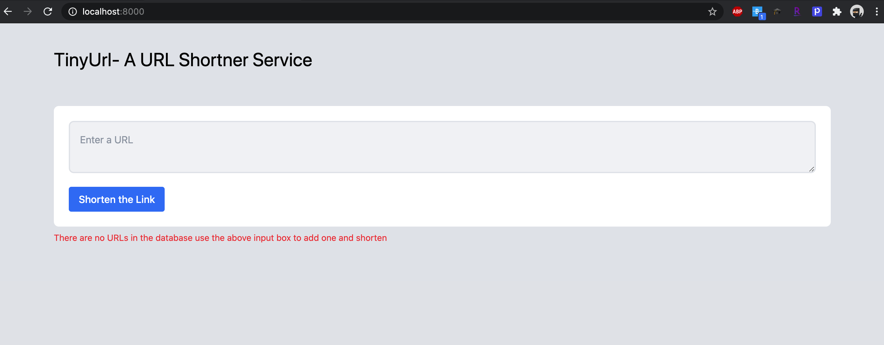

- If input field is empty => `validate` => display the error message to the user.
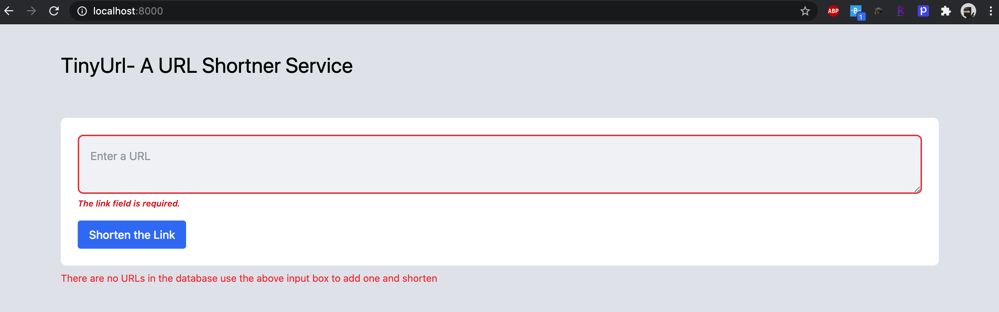

- If input field is not a url => `validate` => display the error message to the user for the same.
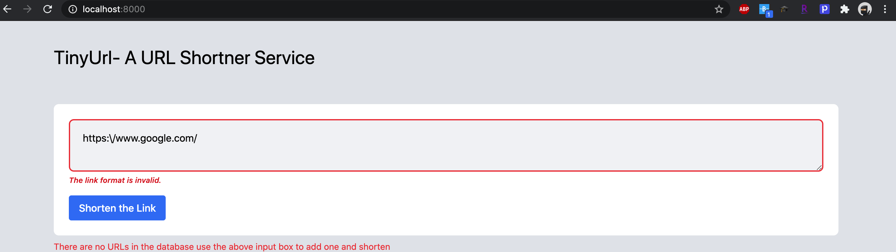

- If any slug which is not in the DB was append to the APP_URL => show the message TinyUrl DOES NOT EXIST!
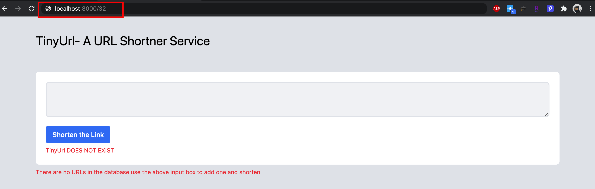

- If a URL not in DB and is valid=> create a slug and add the slug and the enterend URL in DB and show all the created URL to the user.
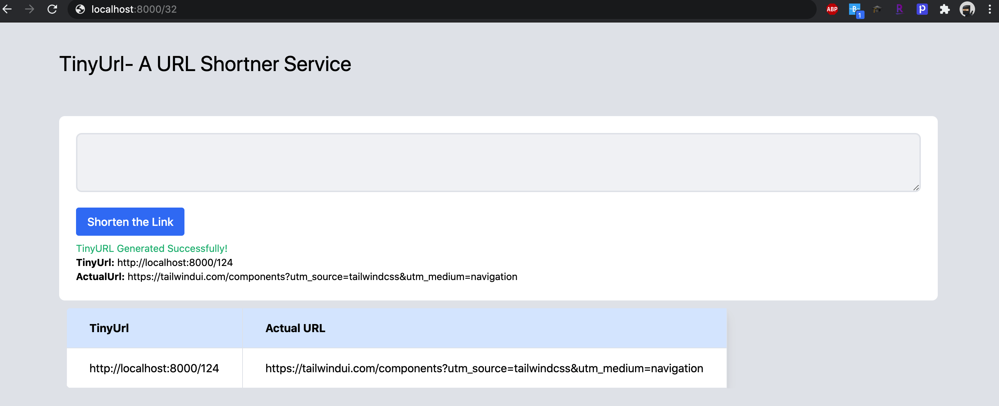

- If a entered URL already in DB => show the message that its already created.
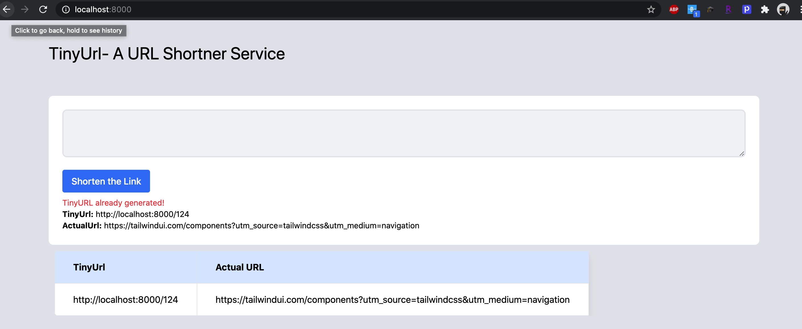

- Models 
    - `slug`: a random number.
    - `link`: the entered URL/link by the user.
- View
    - `shortenLink.blade.php`: Contains all the HTML with @csrf token, @blade directive for error handling and uses `Tailwind CSS` for styling.

- Controller
    - `ShortenLinkController`:
        - `index`: gets all the stored URL with there TinyURL(if any).
        - `store`: validate the entered URL and create a slug using a `generateSlug()` method and create a new record in the DB, otherwise throw error, Success and error messages are also returned.
        - `generateSlug()`: uses a method `base_convert($random_number,int $from_base , int $to_base)` that returns a number converted to a  `to_base`.
            - `$random_number`: uses a  `rand ( int $min , int $max )` and returns a random interger.
        * Alternatively the follwing method can also be used to generate a slug. 
           > The `Str::slug`  method generates a URL friendly "slug" from the given string (I used this for the Live Demo). 
           > The `Str::random` method generates a random string of the specified length.
    - Route::post('/api/generate-link/', [ShortenLinkController::class,'apiStore'])
        - This route was used to handle the `post` request made from the client App and return response back in `JSON`.
    - `ShortenLinkRedirectController`:
        - finds the Link using the slug value stored in the database and helps to redirect to the orignal/stored URL.
    
    NOTE: To combat the `CORS` restriction, a new middleware is configured to allow CORS request from certain whitelisted domain addresses. It is to be noted that while changing the client domain, the whitelist also needs to be updated. CORS was not completly disabled as it is not recommended to lose the security provided against CORS attacks.

- Database
    - Used `PostgreSql` (the most advanced open source database and is available for almost every operating system with the latest stable release)
        - DB_CONNECTION=pgsql
        - DB_HOST=127.0.0.1
        - DB_PORT=5432
        - DB_DATABASE=__CREATE A DATABASE(tinyurl)__
        - DB_USERNAME=__ENTER YOUR USERNAME(apurvamodi)__
        - DB_PASSWORD=__ENTER YOUR PASSWORD(***)__
    - Alternately `SQLite` (which is a in-memory database) can be prefered if memory is the contraint.

### Steps followed to build a Vue App: ###
- Created a new Vue Project
    > npm install -g @vue/cli \
    > vue upgrade --next \
    > vue create tinyurl-dev-client \
    > cd tinyurl-dev-client \
    > npm run serve 
Project runs at: `http://localhost:8080/`

- Added essential libraries
    > npm install --save axios vue-axios

- Created a New component `UrlShortner.vue`
    - Used Axios to `POST` the request at this api => `http://127.0.0.1:8000/api/generate-link/`.
- Lastly Used `Tailwind` CSS inside the `UrlShortner`.

### Different scenarios: ###

- This is the main/landing page.
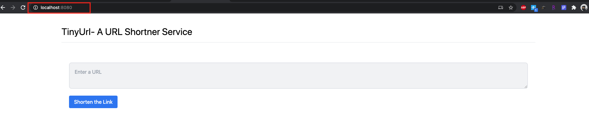

- If input field is empty.
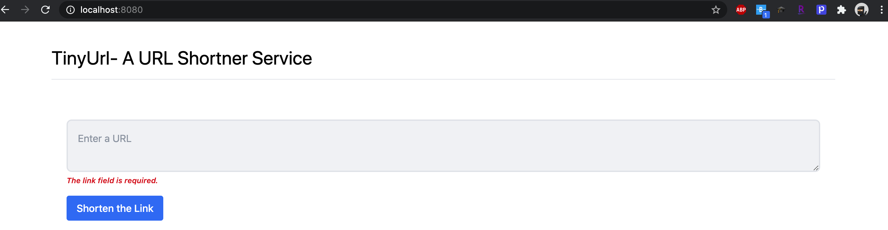

- If input field is not a url.
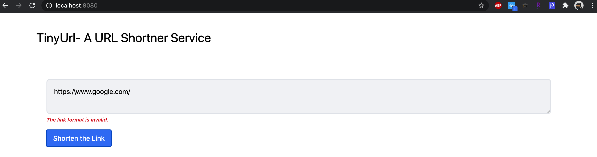

- If a entered URL already in shorten or in DB.
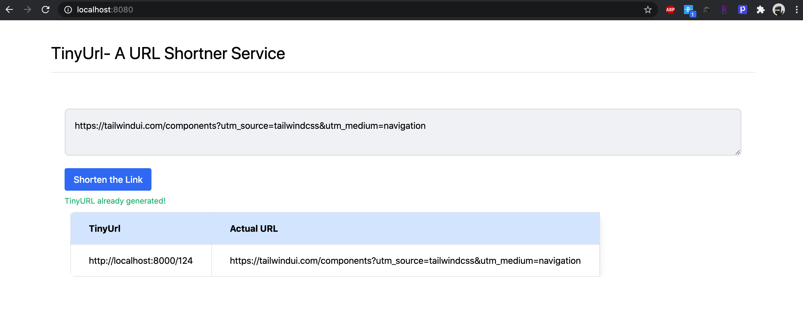

- If a URL not in DB and is valid.
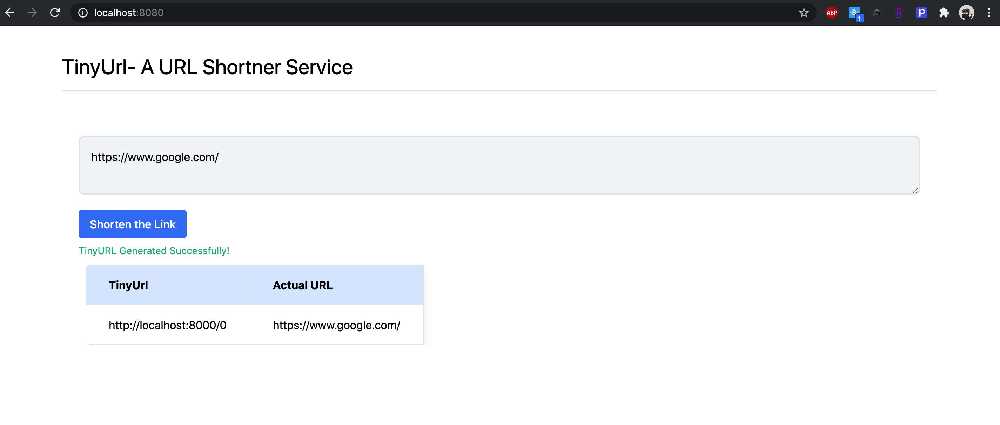

Note:
    `http://localhost:8000/` is serving the larvel Application. 

